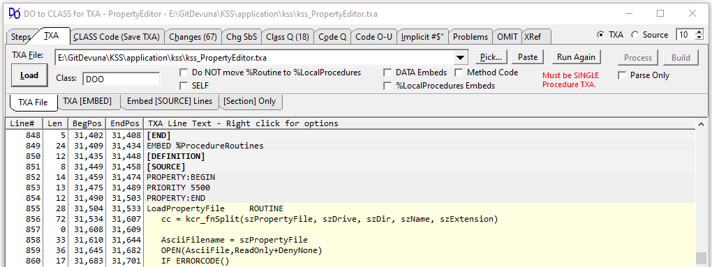

# Do2Class - Convert DO Routine to Local Class

Do2Class utility changes all DO ROUTINE code to call CLASS Methods in a Procedure. The code changes are minor, but to make the changes manually is tedious work, hence the utility to do it right with little work. I built it to be simple and reliable. I make simple changes to the TXA (no moving blocks) so that a compare of TXA file changes is easy to follow. I use it myself on large procedures. I converted KSS and put up a [KSS Do2Class Repo on Guthub](https://github.com/CarlTBarnes/Devuna-KwikSourceSearch).

**Do NOT be put off by the amount I have written below. This is simple, works and any problems discussed below insert tokens like `'? Return was in Routine ?'` into the converted source that cause compiler errors so you cannot miss them.** The only thing that can cause bugs are implicit variables passed between procedure and routine.

The major benefit of the change is Methods allow passing Parameters and can have a Return Value e.g. `NyClass.IsFormOK PROCEDURE(BYTE Force),BOOL.` While there is an extra step of declaring each Method (Procedure) in a data embed CLASS declaration, that provides sort a "Table of Contents" to the local routines that were written for a specific procedure and documents the parameters and returns. With routines to pass and return you must use local variables and that is NOT solid code.

The Class name I prefer to use to replace routines is **DOO CLASS**. I am used to typing `DO` so that makes it easy and I like that it implies it replaces `DO`. You can use any name you like. If you plan to extract the class for use elsewhere then give it a logical name like "ParserClass" and also check the SELF option.

Watch the June 19, 2020 presentation on [Clarion Live](https://www.clarionlive.com/) or on YouTube [Do2Class - Easy change from Routine to Class](https://www.youtube.com/watch?v=8WV_Y_hQEoY&feature=youtu.be). You should also watch 237 and 239 "Lisa's First Class" where most everything done manually is done by Do2Class.

### Procedure for Do2Class

The process for converting in short is Export one Procedure to TXA, Load TXA in Do2Class, Save Do2Class.TXA, Import Do2Class.TXA to APP, Build, Review. To undo the changes import the original TXA. Compare the before and after CLW files you can review **exactly** what was changed. You can also compare TXA files.

- [ ] Backup your APP, CwProj, SLN, CLW files for restore. Also for CLW comparison
- [ ] Clarion: Export One Procedure to TXA and name it APP_ProcName.TXA
- [ ] Do2Class: Load above TXA
- [ ] Do2Class: Review the tabs Steps, Omit, Problems, Implicits
- [ ] Do2Class: Save TXA it will be named App_ProcName_Do2Class_.TXA
- [ ] Clarion: Import App_ProcName_Do2Class_.TXA
- [ ] Clarion: Build - Review errors and fix - Run
- [ ] To understand the process compare CLWs to see exact changes (eventually skip). A quick check of the CLW is after conversion the  line count should have increased 1x - 2x the routine count. Each gets 1 new line to declare the method, plus 1 CODE line, minus 1 line if it had DATA.
- [ ] Undo the changes by simply importing the original TXA export APP_ProcName.TXA

This method will also work with module TXA files as long as they only contain one procedure. It will work with APV files used for version control so it will work with @Rick-UpperPark [Upper Park](http://www.upperparksolutions.com/) integration tool.




## Code Changes Made

1. `RouName ROUTINE` changes to `DOO.RouName PROCEDURE()`
2. `DATA` is removed as only for a Routine
3. `CODE` is added as needed for Procedure
4. `EXIT` is changed to `RETURN`
5. Caller `DO RouName` is changed to `DOO.RouName()`
6. Data Declaration is added for `DOO CLASS`
7. Data Declaration is added `RouName PROCEDURE()` for each routines
8. Problem code gets `? message ?` which will error and force review

Example of Code Before conversion:
```Clarion
  DO Defaults       ! Call Setup Default Values

Defaults ROUTINE    ! Setup Default Values
   Country='USA'
   EXIT  
```

Example of Code After Do2Class:
```Clarion
DOO CLASS             ! Declaration
Defaults PROCEDURE()  ! Setup Default Values
    END

   DOO.Defaults()     ! Call Setup Default Values

DOO.Defaults PROCEDURE()  ! Setup Default Values
  CODE
  Country='USA'
  RETURN
```


## Options

| Tab | Option | Description |
|-----|--------|-----|
| TXA |        | Load TXA Tab |
|     | SELF  | Check to use SELF.Method inside Class method code instead of DOO.Method. <br>If you plan to extract this class and inherit it then check SELF is proper OOP. <br>To replace ROUTINEs I prefer to NOT use SELF and always type DOO. |
|     | Do NOT move %Routine <br>to %LocalProcedures | Methods belong in the %LocalProcedure embed. <br>Uncheck may result in less changes to compare TXA or CLW. |
|     | %LocalProcedures Embeds | Local Procedures can contain Local ROUTINEs which should NOT be processed by Do2Class. <br>If the Procedure incorrectly put its ROUTINEs into this Embed then check this box to process it.  |
|     | DATA Embeds | Check to process Data EMBEDs. <br>Data should NOT have code to change so are skipped. |
|     | Method Code | Process Method Code embeds. I doubt it will work. |
|     |  |  |
| Save  |             | CLASS Code (Save TXA) Tab  |
|       | Omit ! DATA | Uncheck to retain Routine DATA lines as a !DATA comment to allow easily searching for <br>Routines that had DATA to review if it should be encapsulated as Class Data. |
|       | Write CLASS to %Data | Check to Write CLASS declaration and Methods to first Data embed. |
|       | Sort | Check to Sort Methods by Name in CLASS declaration, else in Line Order. |
|       | Tag Implicit !#$" | Tag Implicit Lines !#$" in the save TXA to make it easy to find them and fix. |

## Features

Double click on any LIST line tries to take you to a logical place, e.g. double click on a line on the Problem, Implicit or Omit tab takes you to the view the complete source. Right click on any LIST shows a POPUP of all the other lists that lets you jump to that line in the selected list e.g. on a Problem Right click and on the Popup select TXA to see that line in the TXA file.

XRef tab shows Callee-Caller and Caller-Callee Cross Reference. See screen capture at the end.

## Conversion Issues

Certain code can cause issues when changed from a Routine to a Class Method. Do2Class will identify the important ones on the Problems tab. It also has Implicit variable potential problems for review. Other problems are caught by the compiler. Tokens like `'? Return was in Routine ?'` are inserted into the converted source that cause compiler errors so you cannot miss code that needs refactor.

### Warning – Duplicate Symbol

If a Procedure defines a variable name and that same variable name is also defined in a Routine or Class Method then you have a "Duplicate Symbol". The variables can have different types, they will use their locally defined type because it is a local variable. In a Routine the duplicate does NOT cause a warning, but once changed to a Method the compiler will throw a warning. The code works the same.

There is nothing that *must* be fixed, but it is usually best to refactor the code to NOT have a duplicate by renaming the variable in the Method code or ... This may have revealed a subtle bug in your program. The local duplicate variable is an independent variable. If the routine was relying on referencing the procedure variable that was NOT happening. You may cause a subtle bug (a regression) if you simply remove the local declaration because the method will then be changing the Procedure's variable and that may have not been intended, it may be corrupting the procedures variable.

For Example, in my tests I found KSS had defined `Save_Record STRING(SIZE(Pre:Record))` in a Procedure and also a Routine. Once changed to a Method that caused a compiler duplicate warning. In my video I just commended out the Method declaration to remove the warning. BUT that would cause a subtle bug (regression) because now the Method would change the Procedure's Save_Record variable. I should have renamed the variable in the Method data and code. Renaming in the Procedure also would assure I changed all of them or I would get errors.

```clarion
MyReport PROCEDURE()
Ndx LONG !<- Proc Variable

ScanQ ROUTINE
  DATA
Ndx USHORT !<- No Warning

MyClass.ScanQ PROCEDURE()
Ndx SHORT !<- Warning -
  CODE
```

### Problem – Return in Routine

A `RETURN` in a Routine is from the Procedure but when changed to a Class it will be Method Return not Procedure. You must refactor the calling and new Class code. The Do2Class TXA code will include a line in the Method before the `RETURN` with `? Return was in Routine ?` that will cause an obvious compile error so you cannot miss fixing the code.

This problem will never occur in ABC except in a Source template. In Legacy templates it is unlikely to slip by because the common code `DO ProcedureReturn` will error when moved to a Method.

```clarion
  DO SelectLabelPaper   !Note routine might procedure return

SelectLabelPaper ROUTINE
  Request = SelectRecord
  BrowseLabels()
  IF Response = Cancelled
     DO ProcedureReturn  !<- Legacy code in a Class Method get Compiler Error
     POPBIND ; RETURN    !<- No Compiler Error, just returns from Method
  END
```

One possible refactor is to change the new Method to return a value. Have False to indicate to the caller to Return.

```clarion
SelectLabelPaper PROCEDURE(),BOOL  !Returns False if no Label so must exit

  IF DOO.SelectLabelPaper()=False THEN
     POPBIND ; RETURN
  END

DOO.SelectLabelPaper PROCEDURE() !,BOOL
  CODE
  Request = SelectRecord
  BrowseLabels()
   ? Return was in Routine ?   <-- Do2Class inserted this to force error so cannot miss refactoring
  RETURN CHOOSE(Response <> Cancelled) !Tell caller False if cancelled
```

### Problem – OMITTED(Parameter)

An `IF OMITTED()` in a routine is testing for a `Procedure(<Parameter>)` omitted. When moved to a Class the Omitted() it will be for a Method Parameter. Since the Method will not have that (<Parameter>) the compiler will use the value of the Parameter variable and the code will NOT work right. The code must be refactored to move the Omitted() check outside of the Method. One way is to change that Method back to a Routine. An  OmittedParm.TPL template is provided that generates OMITTED_Variable's for each <Paramater> and the code to set them `OMITTED_Variable=OMITTED(Variable)` right after the CODE statement.  This problem is most likely to occur in ABC where a Routine is required to "see" omitted.

 The Do2Class TXA code will include a line in the Method with `? Omitted() was in Routine ?` that will cause an obvious compile error so you cannot miss fixing the code.

```clarion
PrintMyReport       PROCEDURE(<BYTE _Parm1_>)

SelectLabel ROUTINE
  CODE
  IF OMITTED(_Parm1_) THEN
     !This will work correctly
  END

MyClass.SelectLabel PROCEDURE()  !Routine change to Class Method
  CODE
   ? Omitted() was in Routine ?    <-- Do2Class inserted this to force error so cannot miss refactoring
  IF OMITTED(_Parm1_) THEN     !No Compiler Error
     !Will NOT work as expected
     !_Parm1_ treated as "Expression" i.e. value
  END
```


### Possible Problem – Implicit variables

**Implicit variables can cause regressions in this conversion if they are used to "pass parameters" or the code relies on their value persisting between calls.**

Best move is don’t use Implicit Variables ever, or beyond a few lines of code. Read the help on "Implicit Variables" and note it says
> Therefore, implicit variables should be **used with care and caution**, and **only within a limited scope** (or **not at all**).

An Implicit value set in the Procedure then used in a Routine (i.e. like a parameter) will work and the value persists. When changed to a Class Method the Implicit will be a **independent local variable** for that Method and the code **will NOT work like the Routine**. Implicits in Routines is discussed by the help and the scope and persistence varies based if the procedure also defined it and  a pragma, so best move is **do not use implicits**.

```clarion
    SayHi# = True
    DO ShowHelloWorld
    MyClass.HelloWorld()

ShowHelloWorld ROUTINE
  IF SayHi# THEN Message('You will see this').

MyClass.HelloWorld PROCEDURE()
  CODE
  IF SayHi# THEN |   ! SayHi# is Local so will =0   !#$" <- Do2Class optional Token
     Message('NEVER See Hello SayHi#=' & SayHi#).   !#$" <- Do2Class optional Token
```

Do2Class has an Implicit tab to show you all use of implicit variables. You can double click or right click on the line to see the complete code. On the Save TXA tab is a Check option to "Tag Implicit Code with !#$"" that will add that comment token `!#$"` to all lines that use implicits. This will make it easy to search for them and refactor the code.

## Cross Reference ##

As the conversion is done an XRef is built showing Callee-Caller and Caller-Callee. This can help understand the code and refactor it. Even if you do not convert you may find the Xref helpful. References to \*PROCEDURE\* are for the main procedure calling the routines. You can double click on these lines and just to the source code, or right click on them and a popup menu offers to jump to that line in any of the


